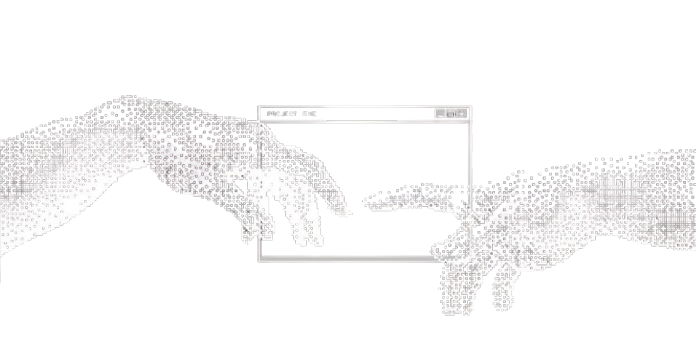

<h1 align="left">Hi, I'm Muhammad Talha Hamid</h1>

  

---

  

    <h2>✨ About Me</h2>
  

I'm a Software Engineering student at FAST NUCES, currently focused on frontend development.
I've studied **C++ through Data Structures and Algorithms**, and now enjoy creating aesthetic and functional web experiences with **HTML**, **CSS**, **JavaScript**, **React**, and **GSAP** for animation. 

I'm deeply interested in building products that offer real service and value to people. Whether it's a hobby project or a startup idea, I love the process of turning concepts into reality with code.

  

    <h2>🎓 Education</h2>
  

- O/A Levels from **LACAS**
- Bachelor's in Software Engineering from **FAST NUCES**
- Future plan: **Masters/Specialization in AI/ML** with a strong software engineering foundation

  

    <h2>💼 Works & Projects</h2>
  

- **Sushi Website** — Responsive, animated layout using modern CSS grid techniques
- **Chess Game (CLI)** — Object-oriented console chess app in C++
- **Inventory Management System (GUI)** — Desktop app built using WinForms
- More projects on the way...

  

    <h2>🎓 Learnings & Interests</h2>
  

- Currently learning advanced frontend practices
- Exploring GSAP, React frameworks, and animation-driven design
- Interested in solving real-world problems through tech & SaaS tools
- Passionate about volunteering, helping others, and exploring entrepreneurial ventures

  

    <h2>🛠️ Technologies & Tools</h2>
  

**Languages:**  
C++, HTML, CSS, JavaScript (learning)

**Frontend:**  
React.js, Next.js (beginner), GSAP, WinForms

**Tools:**  
Git, GitHub, Visual Studio, VS Code, Trello

  

    <h2>🔗 Links & Contact</h2>
  

> I'll be adding my portfolio, LinkedIn, and GitHub stats here soon. Feel free to explore my pinned repositories above in the meantime.

